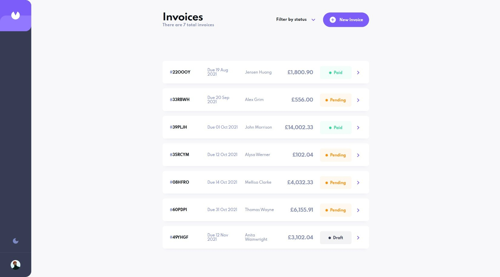

# Frontend Mentor - Invoice app solution

This is a solution to the [Invoice app challenge on Frontend Mentor](https://www.frontendmentor.io/challenges/invoice-app-i7KaLTQjl). Frontend Mentor challenges help you improve your coding skills by building realistic projects.

## Table of contents

- [Overview](#overview)
  - [The challenge](#the-challenge)
  - [Screenshot](#screenshot)
  - [Links](#links)
- [My process](#my-process)
  - [Built with](#built-with)
  - [What I learned](#what-i-learned)
  - [Continued development](#continued-development)
  - [Useful resources](#useful-resources)
- [Author](#author)

## Overview

### The challenge

Users should be able to:

- View the optimal layout for the app depending on their device's screen size
- See hover states for all interactive elements on the page
- Create, read, update, and delete invoices
- Receive form validations when trying to create/edit an invoice
- Save draft invoices, and mark pending invoices as paid
- Filter invoices by status (draft/pending/paid)
- Toggle light and dark mode
- **Bonus**: Keep track of any changes, even after refreshing the browser (`localStorage` could be used for this if you're not building out a full-stack app)

### Screenshot

### Links

- Solution URL: [Invoice App](https://frontendmentor-invoice.web.app/)
- Live Site URL: [Add live site URL here](https://your-live-site-url.com)

## My process

### Built with

- [Angular](https://angular.io) - JS library
- [Angular Material](https://material.angular.io) - Angular UI framework
- [Firebase](https://firebase.google.com/) - For backend database

### What I learned

Learned lots about building a CRUD app with Angular combined with Firebase. Also using Observables to communicate with components along with built in Angular animation libraries.

### Continued development

Looking to fine-tune more knowledge of Angular 16 latest features to do with new module systems. Looking at building project with this new approach in the near future.

### Useful resources

- [Angular Animations](https://zerotomastery.io/blog/angular-animations-and-examples/) - Amazing article on how to master animations using Angular
- [Angular University](https://blog.angular-university.io/) - The best site for all new Angular tutorials and features

## Author

- Frontend Mentor - [@webguy83](https://www.frontendmentor.io/profile/webguy83)
- Instagram - [@canadianwebdev83](https://www.instagram.com/canadianwebdev83)
